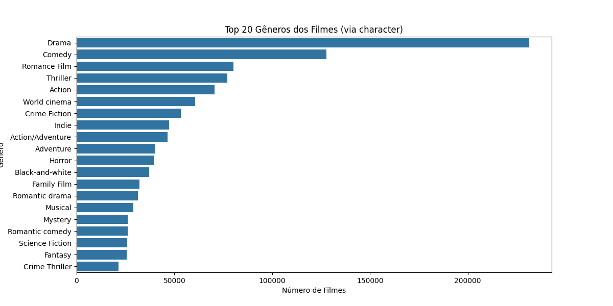
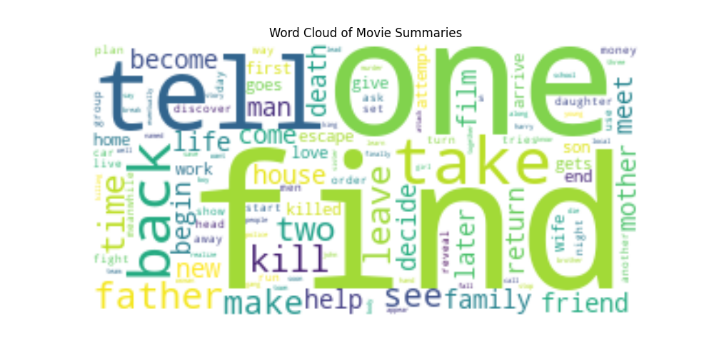

## **Projeto de machine learning**

### Objetivo e introdução
Classificar gêneros de filmes (multi-label) com base em sinopses.


**Descrição:**
Este projeto está desenvolvido no `analyzer.iypnb`, neste `README.MD`, vou realatar os conceitos, abordagens técnicas e conclusão, para que fique de fácil acesso.

---

### **Estrutura do projeto**

- Tratamento de dados
- Análise Exploratória de Dados (EDA)
- Pré-processamento
- Construção do Modelo
- Avaliação do Modelo
- Pipeline de Predição


#### **Tratamento de dados:**


**Descrição:**
Conforme o analisado foi necessário repassar os nomes das colunas para os datasets, foi coletado na fonte de dados o dicionário, assim eu desenvolvi dois `helpers`, para me ajudar.

`laod_dataframe`:

```python
def load_dataframe(filename: str, sep: str = ',', header=None, folder_name: str = 'data') -> pd.DataFrame:
    file_path = filename
    if not os.path.isabs(filename):
        file_path = os.path.join(folder_name, filename)

    if not os.path.exists(file_path):
        raise FileNotFoundError(f"O arquivo '{file_path}' não foi encontrado.")

    df = pd.read_csv(file_path, sep=sep, header=header)
    return df
```

**Função** para realizar o carregamento do arquivo, é bem comum desenvolver esses `helpers`, para melhorar a legibilidade do código e evitar ficar passando o `path` do seu diretório e deixando ele hardcode.

**Exemplo**:

```python
movie = load_dataframe(filename='movie.metadata.tsv', sep='\t')
character = load_dataframe(filename='character.metadata.tsv', sep='\t')
summaries = load_dataframe(filename='plot_summaries.txt', sep='\t')
```

`DataCleaner`

```python
class DataCleaner:

    def __init__(self, df: str):
        self.df = df

    def clean_character_data(self) -> pd.DataFrame:
        rename_map = {
            0: 'movie_id',
            1: 'freebase_id',
            2: 'release_date',
            3: 'character_name',
            4: 'actor_birth_date',
            5: 'actor_gender',
            6: 'actor_height_m',
            7: 'actor_ethnicity_id',
            8: 'actor_name',
            9: 'actor_age_at_release',
            10: 'freebase_character_actor_map_id',
            11: 'freebase_character_id',
            12: 'freebase_actor_id'
        }
        df = self.df.rename(columns=rename_map)
        return df

    def clean_movie_data(self) -> pd.DataFrame:
        rename_map = {
            0: 'wikipedia_id',
            1: 'freebase_id',
            2: 'name',
            3: 'release_date',
            4: 'box_office',
            5: 'runtime',
            6: 'languages',
            7: 'countries',
            8: 'freebase_character_map'
        }
        df = self.df.rename(columns=rename_map)
        return df

    def clean_summaries_data(self) -> pd.DataFrame:
        rename_map = {
            0: 'movie_id',
            1: 'summary',
        }
        df = self.df.rename(columns=rename_map)
        return df
```

**Class** responsavel para renomear as colunas e que fique de fácil acesso para prosegur com as manipulação de dados, extração e construção de modelo.


**Exemplo:**

```python
movie = DataCleaner(movie).clean_movie_data()
character = DataCleaner(character).clean_character_data()
summaries = DataCleaner(summaries).clean_summaries_data()
```


#### **Análise exploratória de dados**

Como o separado das variáveis movies e character e summaries, elas são responsáveis pelos os dataframes coletados.

Está sendo realizada uma união de dados entre o dataframes de caracteres e o sumário, onde é construída, uma tabela com o registro do filme, o carácter coletado, e gênero da pessoa do registro. Entre essa análise e a decisão, tem uma conexão de tratamento de dados entre o dataframes de filmes e caracteres. Após a manipulação, conseguimos analisar a maior frequência de gênero de filmes.


**Top 20 Gêneros dos Filmes (via character):**

Realizado a plotagem de gráfico dos tops 20 filmes após 
a manipulação de dados.

Insight: (Gêneros como "**Drama**" e "**Comedy**" podem dominar, indicando desbalanceamento.)

</img>


**Distribuição do Comprimento das Sinopses (em palavras):**

Realizado a plotagem do gráfico de distribuição em palavras.

Insight: Se sinopses forem muito longas, precisaremos truncar para modelos como BERT de exemplo, é necesário uma pesquisa.

</img>

**Nuvem de etiquetas:**

Realizado a plotagem da nuvem de etiquetas, foi realizado uma perfomance no código, para processar as palavras, com a manipulação de remoção de pontuação, remoção de dados nulos, escolhemos alteatoriamente 1000 sinopes para ganho de perfomance
contendo um parâmetro **random_state**, onde garantimos um reprodutível.

Insight: Palavras como "**life**", "**love**" sugerem temas comuns.

</img>


#### **Pré-processamento:**

- Realizamos o inner join entre o sumario e filme, associando eles por id do registro na tabela do filme.
- Remoção de dados nulos em generos apos a conversão do **freebase_charcater_map**.
- Limpeza de texto, convertentdo para minúscula, removendo caracteres especiaias e stop words.
- MultiLabelBinarizer transformar a lista de gêneros em uma matriz binaária (1 se o gênero está presente, 0 caso contrário).
- TF-IDF, com o termo de frequência gera vetores esparsos com até 5000 features, incluindo unigramas e bigramas. BERT tokeniza as sinopses com o maximo de tamanho de registro com 128, para limitar o uso de memória.
- Divisão: Dividimos 80/20 para treino/teste, mantendo a mesma semente para consistência entre TF-IDF e BERT. Insights:
- A matriz y tem uma coluna por gênero, indicando um problema multilabel. O número de features no TF-IDF (5000) é um trade-off entre riqueza e memória. BERT lida melhor com contexto, mas exige mais poder computacional.Vamos lidar com outra estratégia


```python
Shape de X_tfidf: (41793, 5000)
Shape de y: (41793, 363)
Gêneros válidos: 363
```


**Descrição**

Pré-processamento de modelo foi abordado uma estratégia definida pelo o problema atual, notei uma grande dificuldade em ramificação de versão do `transformes`, lembrando que o `hugging face`, é uma comunidade bem atualizada, mas se não souber qual versão é a melhor para cada tipo de problema fica um pouco difícil de resolver, estava abordando o `bert` entre os problemas citados versão, seria necessário mais um polo de pesquisa para resolver esse problema com maestria, abordei escolha.


#### **Construção do Modelo:**