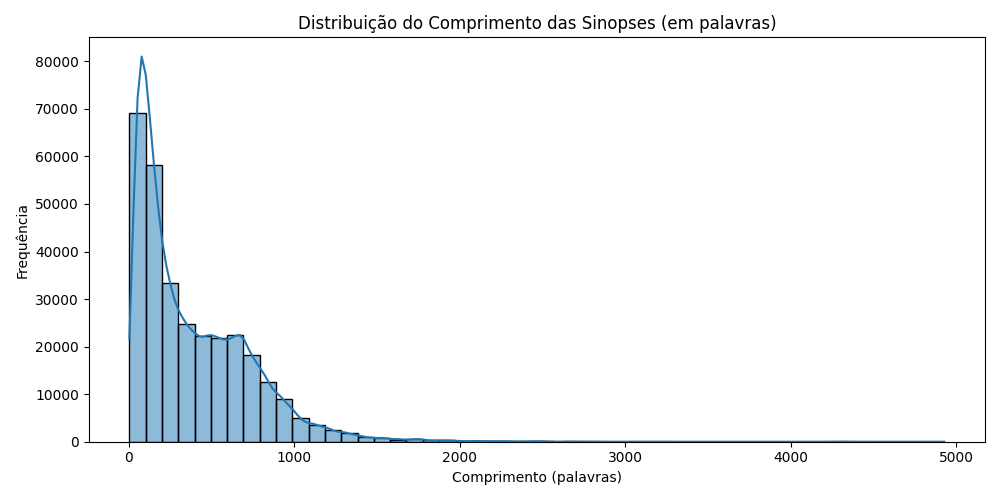
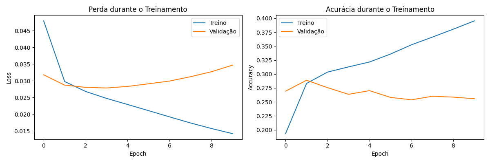

## **Projeto de machine learning** 

### Objetivo e introdução
Classificar gêneros de filmes (multi-label) com base em sinopses.


**Descrição:** 
Este projeto está desenvolvido no `analyzer.iypnb`, neste `README.MD`, vou realatar os conceitos, abordagens técnicas e conclusão, para que fique de fácil acesso.

---

### **Estrutura do projeto**

- Tratamento de dados
- Análise Exploratória de Dados (EDA)
- Pré-processamento
- Construção do Modelo
- Avaliação do Modelo
- Pipeline de Predição

**Instalando as dependências**

Se você for rodar em máquina local, é necessário criar um ambiente virtual e instalar as dependências

```bash
pip install -r requirements.txt
```

**Fonte dos dados:**


#### **Tratamento de dados:**


**Descrição:** 
Conforme o analisado foi necessário repassar os nomes das colunas para os datasets, foi coletado na fonte de dados o dicionário, assim eu desenvolvi dois `helpers`, para me ajudar.

`laod_dataframe`:

```python
def load_dataframe(filename: str, sep: str = ',', header=None, folder_name: str = 'data') -> pd.DataFrame:
    file_path = filename
    if not os.path.isabs(filename):
        file_path = os.path.join(folder_name, filename)

    if not os.path.exists(file_path):
        raise FileNotFoundError(f"O arquivo '{file_path}' não foi encontrado.")

    df = pd.read_csv(file_path, sep=sep, header=header)
    return df
```

**Função** para realizar o carregamento do arquivo, é bem comum desenvolver esses `helpers`, para melhorar a legibilidade do código e evitar ficar passando o `path` do seu diretório e deixando ele hardcode.

**Exemplo**:

```python
movie = load_dataframe(filename='movie.metadata.tsv', sep='\t')
character = load_dataframe(filename='character.metadata.tsv', sep='\t')
summaries = load_dataframe(filename='plot_summaries.txt', sep='\t')
```

`DataCleaner`

```python
class DataCleaner:

    def __init__(self, df: str):
        self.df = df

    def clean_character_data(self) -> pd.DataFrame:
        rename_map = {
            0: 'movie_id',
            1: 'freebase_id',
            2: 'release_date',
            3: 'character_name',
            4: 'actor_birth_date',
            5: 'actor_gender',
            6: 'actor_height_m',
            7: 'actor_ethnicity_id',
            8: 'actor_name',
            9: 'actor_age_at_release',
            10: 'freebase_character_actor_map_id',
            11: 'freebase_character_id',
            12: 'freebase_actor_id'
        }
        df = self.df.rename(columns=rename_map)
        return df

    def clean_movie_data(self) -> pd.DataFrame:
        rename_map = {
            0: 'wikipedia_id',
            1: 'freebase_id',
            2: 'name',
            3: 'release_date',
            4: 'box_office',
            5: 'runtime',
            6: 'languages',
            7: 'countries',
            8: 'freebase_character_map'
        }
        df = self.df.rename(columns=rename_map)
        return df

    def clean_summaries_data(self) -> pd.DataFrame:
        rename_map = {
            0: 'movie_id',
            1: 'summary',
        }
        df = self.df.rename(columns=rename_map)
        return df
```

**Class** responsavel para renomear as colunas e que fique de fácil acesso para prosegur com as manipulação de dados, extração e construção de modelo.


**Exemplo:**

```python
movie = DataCleaner(movie).clean_movie_data()
character = DataCleaner(character).clean_character_data()
summaries = DataCleaner(summaries).clean_summaries_data()
```


#### **Análise exploratória de dados**

Como o separado das variáveis movies e character e summaries, elas são responsáveis pelos os dataframes coletados.

Está sendo realizada uma união de dados entre o dataframes de caracteres e o sumário, onde é construída, uma tabela com o registro do filme, o carácter coletado, e gênero da pessoa do registro. Entre essa análise e a decisão, tem uma conexão de tratamento de dados entre o dataframes de filmes e caracteres. Após a manipulação, conseguimos analisar a maior frequência de gênero de filmes.


**Top 20 Gêneros dos Filmes (via character):**

Realizado a plotagem de gráfico dos tops 20 filmes após 
a manipulação de dados.

Insight: (Gêneros como "**Drama**" e "**Comedy**" podem dominar, indicando desbalanceamento.)

</img>


**Distribuição do Comprimento das Sinopses (em palavras):**

Realizado a plotagem do gráfico de distribuição em palavras.

Insight: Se sinopses forem muito longas, precisaremos truncar para modelos como BERT de exemplo, é necesário uma pesquisa.

</img>

**Nuvem de etiquetas:**

Realizado a plotagem da nuvem de etiquetas, foi realizado uma perfomance no código, para processar as palavras, com a manipulação de remoção de pontuação, remoção de dados nulos, escolhemos alteatoriamente 1000 sinopes para ganho de perfomance
contendo um parâmetro **random_state**, onde garantimos um reprodutível.

Insight: Palavras como "**life**", "**love**" sugerem temas comuns.

</img>


#### **Pré-processamento:**

- Realizamos o inner join entre o sumario e filme, associando eles por id do registro na tabela do filme.
- Remoção de dados nulos em generos apos a conversão do **freebase_charcater_map**.
- Limpeza de texto, convertentdo para minúscula, removendo caracteres especiaias e stop words.
- MultiLabelBinarizer transformar a lista de gêneros em uma matriz binaária (1 se o gênero está presente, 0 caso contrário).
- TF-IDF, com o termo de frequência gera vetores esparsos com até 5000 features, incluindo unigramas e bigramas. BERT tokeniza as sinopses com o maximo de tamanho de registro com 128, para limitar o uso de memória.
- Divisão: Dividimos 80/20 para treino/teste, mantendo a mesma semente para consistência entre TF-IDF e BERT. Insights:
- A matriz y tem uma coluna por gênero, indicando um problema multilabel. O número de features no TF-IDF (5000) é um trade-off entre riqueza e memória. BERT lida melhor com contexto, mas exige mais poder computacional.Vamos lidar com outra estratégia


```python
# resultado
Shape de X_tfidf: (41793, 5000)
Shape de y: (41793, 363)
Gêneros válidos: 363
```


**Descrição** 

Pré-processamento de modelo foi abordado uma estratégia definida pelo o problema atual, notei uma grande dificuldade em ramificação de versão do `transformes`, lembrando que o `hugging face`, é uma comunidade bem atualizada, mas se não souber qual versão é a melhor para cada tipo de problema fica um pouco difícil de resolver, estava abordando o `bert` entre os problemas citados versão, seria necessário mais um polo de pesquisa para resolver esse problema com maestria, abordei escolha.


#### **Construção do Modelo:**


**Descrição:** 

Perda durante o treinamento e acurácia durante o treinamento, podemos ver o gráfico linear durante a execução.

</img>


#### **Avaliação do Modelo:**


`Baseline (Logistic Regression)`
```python
print("\nRelatório de Classificação (Baseline):")
print(classification_report(y_test, y_pred_tfidf, target_names=new_mlb.classes_, zero_division=0))
print("\nRelatório de Classificação (Keras):")
print(classification_report(y_test, y_pred_keras, target_names=new_mlb.classes_, zero_division=0))
```

`Resultado:`

```bash
Baseline (Logistic Regression):
F1-score (macro): 0.028301512993177652
Precision (macro): 0.09334821245354745
Recall (macro): 0.019123638295692556
Hamming Loss: 0.008862290920823367
```


`Keras (Rede Neural)`


```python
print("\nKeras (Rede Neural):")
print("F1-score (macro):", f1_score(y_test, y_pred_keras, average='macro'))
print("Precision (macro):", precision_score(y_test, y_pred_keras, average='macro'))
print("Recall (macro):", recall_score(y_test, y_pred_keras, average='macro'))
print("Hamming Loss:", hamming_loss(y_test, y_pred_keras))
```

`Resultado`

```bash
Keras (Rede Neural):
F1-score (macro): 0.074055775393238
Precision (macro): 0.14715865381697943
Recall (macro): 0.056083293596994065
Hamming Loss: 0.009392228959597827
```


`Relatório de Classificação (Baseline)`

```python
print("\nRelatório de Classificação (Baseline):")
print(classification_report(y_test, y_pred_tfidf, target_names=new_mlb.classes_, zero_division=0))
print("\nRelatório de Classificação (Keras):")
print(classification_report(y_test, y_pred_keras, target_names=new_mlb.classes_, zero_division=0))
```

`Resultado`
```bash

Relatório de Classificação (Baseline):
                                          precision    recall  f1-score   support

                               Absurdism       0.00      0.00      0.00        16
                            Acid western       0.00      0.00      0.00         3
                                  Action       0.62      0.27      0.38      1181
                           Action Comedy       0.00      0.00      0.00        26
                        Action Thrillers       0.00      0.00      0.00        86
                        Action/Adventure       0.58      0.14      0.23       733
                         Addiction Drama       0.00      0.00      0.00         8
                                   Adult       0.00      0.00      0.00        25
                               Adventure       0.65      0.14      0.24       669
                        Adventure Comedy       0.00      0.00      0.00        28
                  Airplanes and airports       0.00      0.00      0.00         9
                             Albino bias       0.00      0.00      0.00         6
                              Alien Film       0.00      0.00      0.00        17
                          Alien invasion       0.00      0.00      0.00         1
                               Americana       0.00      0.00      0.00        13
                          Animal Picture       0.00      0.00      0.00        29
                                 Animals       0.00      0.00      0.00         4
                        Animated Musical       0.00      0.00      0.00         4
                        Animated cartoon       0.00      0.00      0.00        23
                               Animation       0.80      0.35      0.49       479
                                   Anime       1.00      0.02      0.03        66
...
                               macro avg       0.15      0.06      0.07     30335
                            weighted avg       0.47      0.33      0.37     30335
                             samples avg       0.53      0.37      0.39     30335
```


#### **Pipiline de predição**

**Descrição:** 
Baseline: Pipeline com `tfidf` e `model`.
Keras: Função que carrega o modelo `.h5` e prevê com threshold 0.5.
Testa com uma sinopse de exemplo.


```python
prediction_pipeline = Pipeline([
    ('tfidf', joblib.load('models/tfidf.pkl')),
    ('model', joblib.load('models/baseline_model.pkl'))
])
```

```python
def predict_genres_keras(summary):
    cleaned_summary = clean_text(summary)
    X = tfidf.transform([cleaned_summary]).toarray()
    model = load_model('models/keras_model.h5')
    pred = (model.predict(X) > 0.5).astype(int)
    genres = new_mlb.inverse_transform(pred)[0]
    return genres

# testando
new_summary = "A young wizard discovers his magical powers and attends a school of witchcraft."
# new_summary = "A young wizard who discovers his actions"
print("Baseline - Gêneros previstos:", predict_genres_baseline(new_summary))
print("Keras - Gêneros previstos:", predict_genres_keras(new_summary))
```


`Resultado`


```bash
Baseline - Gêneros previstos: ('Fantasy',)
1/1 ━━━━━━━━━━━━━━━━━━━━ 0s 31ms/step
Keras - Gêneros previstos: ('Fantasy', 'Science Fiction')
```


#### **Conclusão**

Implementamos dois modelos para classificação multi-label:
- **Baseline (Logistic Regression)**: Simples, rápido, mas limitado para padrões complexos.
- **Keras (Rede Neural)**: Mais poderoso, captura não-linearidades, com configuração simples.

O pipeline de predição permite prever gêneros a partir de sinopses brutas, pronto para uso em produção.

**Resultados**:
- A EDA revelou desbalanceamento de gêneros (e.g., 'Drama' domina).
- O pré-processamento lidou com gêneros raros, evitando erros.
- A rede neural deve superar o baseline em F1-score, mas requer ajuste fino.

**Próximos passos**:
- Ajustar hiperparâmetros da rede neural (camadas, epochs).
- Experimentar técnicas para desbalanceamento (e.g., class weights).
- Testar com embeddings pré-treinados (se necessário).

**Nota**: Evitamos o Hugging Face Transformers para simplificar a compatibilidade, usando bibliotecas estáveis (scikit-learn, Keras).